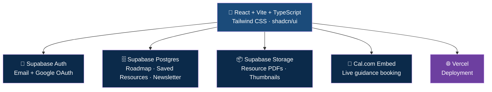
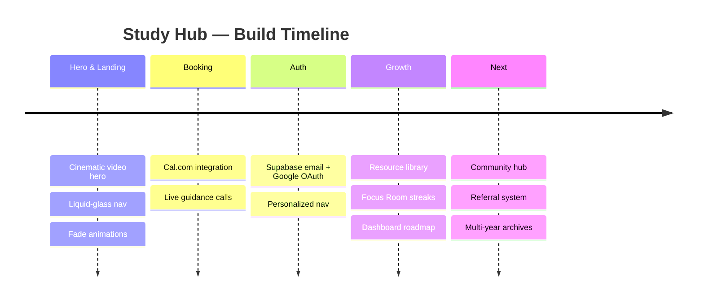

<div align="center">


<a href="https://study-hub-app.vercel.app">
  
</a>
<a href="#-features">
  
</a>
<a href="#-getting-started">
  
</a>

<br/><br/>


<br/>


</div>

<br/>

## 🎬 See it in motion

<div align="center">

<!-- Replace this with a real screen recording. GitHub supports .mp4 / .mov / .webm
     uploaded via drag-and-drop directly into an Issue/PR/README edit box — it will
     generate a real githubusercontent.com URL you can drop below. -->

**[⬇ Drop your own demo GIF/video URL here — GitHub auto-hosts anything you drag into the README editor]**


<sub>Hero video · Auth flow · Focus Room timer · Dashboard roadmap · Resource library</sub>

</div>

<br/>

## ✨ Features

<table>
<tr>
<td width="50%" valign="top">

### 🎥 Cinematic Landing
Full-bleed looping video hero, liquid-glass navigation, Instrument Serif typography, and a starfield-to-study-desk visual arc that sets the tone before a word is read.

### 🔐 Real Auth
Email + Google OAuth via Supabase. Instant sign-up, no dead-end verification emails, personalized nav with live avatar.

### 📅 Live Booking
Inline Cal.com embed for free 1-on-1 guidance calls — book, reschedule, and manage entirely inside the site.

</td>
<td width="50%" valign="top">

### 📚 Resource Library
Searchable, filterable archive of GATE, JEE Advanced, and more — official papers and answer keys, bookmarkable per-user.

### ⏱️ Focus Room
A circular-progress study timer with streaks, session history, and encouragement that adapts to your momentum.

### 🗺️ Personal Dashboard
Supabase-backed roadmap tracker and saved resources — your prep plan, tied to your account, everywhere you log in.

</td>
</tr>
</table>

<br/>

## 🏗️ Architecture



<br/>

## 🧰 Tech Stack

<div align="center">


</div>

<br/>

<table align="center">
<tr>
<th>Layer</th><th>Technology</th>
</tr>
<tr><td>Frontend</td><td>React · Vite · TypeScript · Tailwind CSS · shadcn/ui</td></tr>
<tr><td>Auth</td><td>Supabase Auth (Email + Google OAuth)</td></tr>
<tr><td>Database</td><td>Supabase Postgres with Row Level Security</td></tr>
<tr><td>Storage</td><td>Supabase Storage (public resource buckets)</td></tr>
<tr><td>Booking</td><td>Cal.com embed (@calcom/embed-react)</td></tr>
<tr><td>Icons</td><td>lucide-react</td></tr>
<tr><td>Deployment</td><td>Vercel</td></tr>
</table>

<br/>

## 📊 Repo Stats

<div align="center">


</div>

<br/>

## 🚀 Getting Started

```bash
# Clone
git clone https://github.com/pradhummandil/Study-Hub.git
cd Study-Hub

# Install
npm install

# Environment
cp .env.example .env
# Fill in VITE_SUPABASE_URL and VITE_SUPABASE_ANON_KEY

# Run
npm run dev
```

<details>
<summary><b>📦 Environment variables needed</b></summary>

<br/>

| Variable | Description |
|---|---|
| `VITE_SUPABASE_URL` | Your Supabase project URL |
| `VITE_SUPABASE_ANON_KEY` | Supabase anon/public key |
| `SUPABASE_SERVICE_ROLE_KEY` | Server-side only, for bulk resource uploads — never exposed client-side |

</details>

<br/>

## 🗺️ Roadmap



<br/>

## 🤝 Contributing

Pull requests are welcome. For major changes, open an issue first to discuss what you'd like to change.

```bash
git checkout -b feature/your-feature
git commit -m "Add: your feature"
git push origin feature/your-feature
```

<br/>

## 📄 License

Distributed under the MIT License. See `LICENSE` for details.

<br/>

<div align="center">


**Built by [Pradhum Mandil](https://github.com/pradhummandil)**
<br/>
<sub>Full-stack developer · GATE 2027 aspirant · Quiet-grind believer</sub>

</div>
